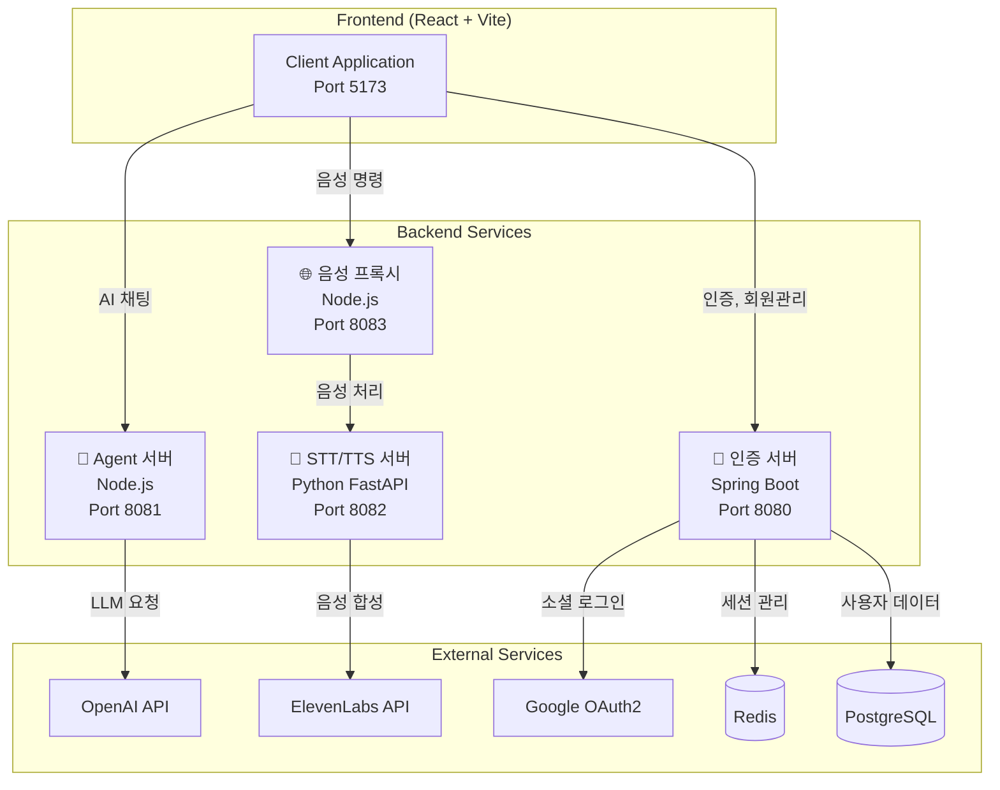
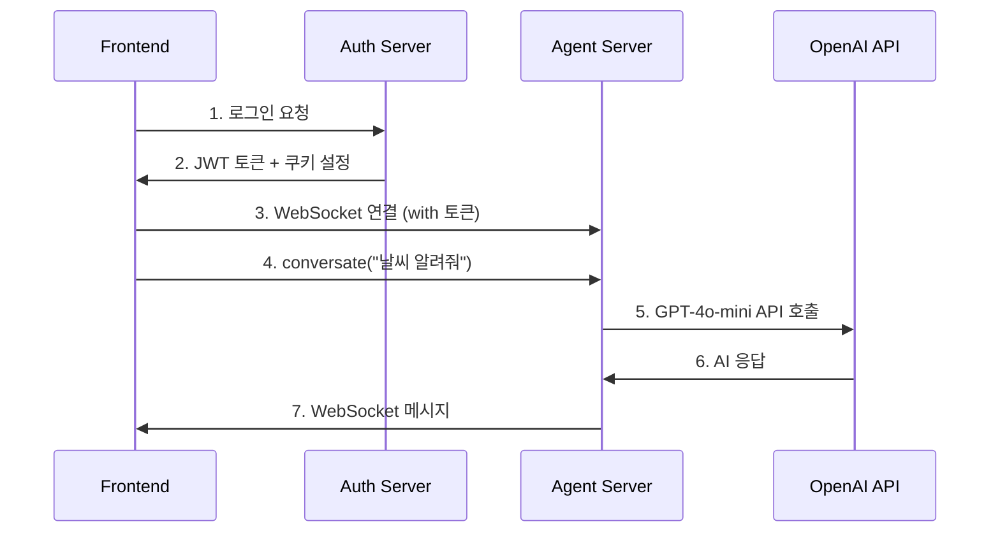
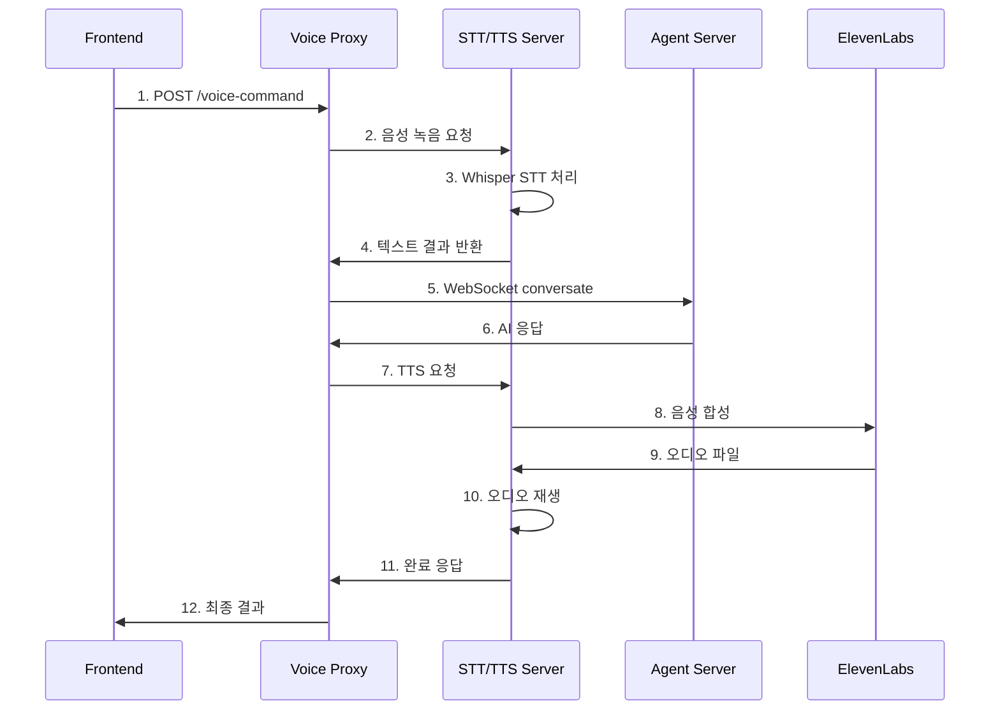
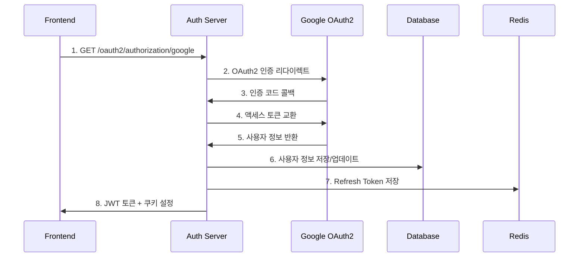
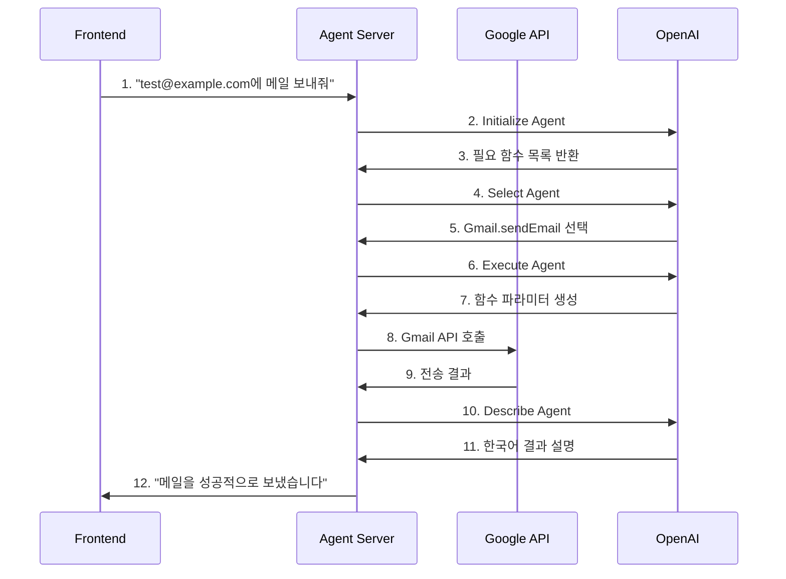

# 🚀 Agentica 마이크로서비스 플랫폼 API 명세서
## 완전한 API 문서화

---

## 📋 목차
1. [시스템 아키텍처 개요](#시스템-아키텍처-개요)
2. [🔐 인증 서버 API (Spring Boot - Port 8080)](#-인증-서버-api-spring-boot---port-8080)
3. [🤖 AI Agent 서버 API (Node.js - Port 8081)](#-ai-agent-서버-api-nodejs---port-8081)
4. [🎤 음성 서비스 API (Python - Port 8082)](#-음성-서비스-api-python---port-8082)
5. [🌐 음성 프록시 서버 (Node.js - Port 8083)](#-음성-프록시-서버-nodejs---port-8083)
6. [💻 프론트엔드 API 호출 규격](#-프론트엔드-api-호출-규격)
7. [🔄 서비스 간 통신 흐름](#-서비스-간-통신-흐름)

---

## 시스템 아키텍처 개요
'


---

## 🔐 인증 서버 API (Spring Boot - Port 8080)

### Base URL
```
http://localhost:8080/api
```

### 인증 관리 API

#### 1. 이메일 인증번호 전송
```http
POST /api/auth/send-verification-code
Content-Type: application/json

{
  "email": "user@example.com"
}
```

**응답:**
```json
{
  "success": true,
  "message": "인증번호가 전송되었습니다. 이메일을 확인해주세요.",
  "data": null,
  "timestamp": "2025-01-27T17:30:00"
}
```

#### 2. 인증번호 확인
```http
POST /api/auth/verify-code
Content-Type: application/json

{
  "email": "user@example.com",
  "verificationCode": "123456"
}
```

#### 3. 이메일 중복 확인
```http
GET /api/auth/check-email?email=user@example.com
```

**응답:**
```json
{
  "success": true,
  "data": {
    "exists": false
  },
  "message": null,
  "timestamp": "2025-01-27T17:30:00"
}
```

#### 4. 회원가입
```http
POST /api/auth/join
Content-Type: application/json

{
  "email": "user@example.com",
  "password": "password123!",
  "name": "홍길동",
  "verificationCode": "123456"
}
```

#### 5. 로그인
```http
POST /api/auth/login
Content-Type: application/json

{
  "email": "user@example.com",
  "password": "password123!"
}
```

**응답:**
```json
{
  "success": true,
  "data": {
    "accessToken": "eyJhbGciOiJIUzI1NiIs...",
    "refreshToken": "eyJhbGciOiJIUzI1NiIs...",
    "tokenType": "Bearer",
    "expiresIn": 1800
  },
  "message": null,
  "timestamp": "2025-01-27T17:30:00"
}
```

**쿠키 설정:**
- `accessToken`: HTTP-Only, 30분
- `refreshToken`: HTTP-Only, 7일

#### 6. 토큰 갱신
```http
POST /api/auth/refresh
Content-Type: application/json

{
  "refreshToken": "eyJhbGciOiJIUzI1NiIs..."
}
```

#### 7. 로그아웃
```http
POST /api/auth/logout
Authorization: Bearer {accessToken}
```

#### 8. 소셜 로그인 (OAuth2)
```http
GET /api/auth/oauth2/authorization/google
GET /api/auth/oauth2/authorization/naver
GET /api/auth/oauth2/authorization/kakao
```

**OAuth2 콜백 처리:**
- 성공: 자동으로 JWT 토큰 생성 및 쿠키 설정
- 실패: 로그인 페이지로 리다이렉트

### 회원 관리 API

#### 1. 내 정보 조회
```http
GET /api/member/me
Authorization: Bearer {accessToken}
```

**응답:**
```json
{
  "success": true,
  "data": {
    "id": 1,
    "email": "user@example.com",
    "name": "홍길동",
    "authProvider": "LOCAL",
    "createdAt": "2025-01-27T17:30:00",
    "updatedAt": "2025-01-27T17:30:00"
  }
}
```

#### 2. 비밀번호 확인
```http
POST /api/member/verify-password
Authorization: Bearer {accessToken}
Content-Type: application/json

{
  "password": "current_password"
}
```

#### 3. 프로필 수정
```http
PUT /api/member/update
Authorization: Bearer {accessToken}
Content-Type: application/json

{
  "name": "새이름",
  "currentPassword": "current_password",
  "newPassword": "new_password123!"
}
```

### 계정 삭제 API

#### 1. 계정 삭제 요청
```http
POST /api/auth/initiate-delete-account
Authorization: Bearer {accessToken}
Content-Type: application/json

{
  "password": "user_password",
  "reason": "서비스 불만족"
}
```

#### 2. 계정 삭제 완료
```http
DELETE /api/auth/delete-account
Authorization: Bearer {accessToken}
Content-Type: application/json

{
  "password": "user_password",
  "reason": "서비스 불만족"
}
```

---

## 🤖 AI Agent 서버 API (Node.js - Port 8081)

### Base URL
```
ws://localhost:8081
```

### WebSocket 연결

#### 1. WebSocket 연결 설정
```javascript
const ws = new WebSocket('ws://localhost:8081');

ws.onopen = () => {
  console.log('Agentica Agent 서버 연결됨');
};

ws.onmessage = (event) => {
  const data = JSON.parse(event.data);
  console.log('Agent 응답:', data);
};
```

#### 2. 대화 요청 (Conversate)
```javascript
// RPC 호출 방식
const message = {
  method: 'conversate',
  params: {
    prompt: '오늘 날씨 알려줘',
    locale: 'ko-KR'
  },
  id: 'unique-request-id'
};

ws.send(JSON.stringify(message));
```

**응답 형식:**
```json
{
  "id": "unique-request-id",
  "result": {
    "id": "conv-12345",
    "type": "assistantMessage",
    "content": "오늘 서울의 날씨는 맑음이며, 기온은 15도입니다.",
    "timestamp": "2025-01-27T17:30:00",
    "tokenUsage": {
      "promptTokens": 45,
      "completionTokens": 23,
      "totalTokens": 68
    }
  }
}
```

### 지원하는 AI 커넥터

#### Google 서비스
- **Gmail**: 이메일 읽기, 전송, 검색
- **Google Calendar**: 일정 조회, 생성, 수정
- **Google Drive**: 파일 업로드, 다운로드, 공유
- **Google Docs**: 문서 생성, 편집
- **Google Sheets**: 스프레드시트 조작
- **Google Search**: 웹 검색
- **Google Shopping**: 쇼핑 검색
- **Google Trends**: 트렌드 데이터

#### 소셜 & 커뮤니케이션
- **Discord**: 메시지 전송, 서버 관리
- **KakaoTalk**: 메시지 전송
- **Github**: 저장소 관리, 이슈 생성

#### 기타 서비스
- **Notion**: 페이지 생성, 데이터베이스 조작
- **Naver Cafe**: 카페 글 작성, 댓글
- **Kakao Map**: 지도 검색, 길찾기

### 커넥터 사용 예시

#### Gmail 이메일 전송
```javascript
const emailRequest = {
  method: 'conversate',
  params: {
    prompt: 'test@example.com으로 "안녕하세요" 제목으로 메일 보내줘',
    locale: 'ko-KR'
  }
};
```

#### Google Calendar 일정 생성
```javascript
const calendarRequest = {
  method: 'conversate',
  params: {
    prompt: '내일 오후 3시에 회의 일정 추가해줘',
    locale: 'ko-KR'
  }
};
```

---

## 🎤 음성 서비스 API (Python - Port 8082)

### Base URL
```
http://localhost:8082/api
```

### STT (Speech-to-Text) API

#### 1. 음성 녹음 및 변환
```http
POST /api/record-and-transcribe
Content-Type: application/json

{
  "duration": 15.0
}
```

**응답:**
```json
{
  "success": true,
  "text": "안녕하세요, 오늘 날씨가 어떤가요?",
  "duration": 15.0,
  "processing_time": 3.2,
  "message": "음성 인식 완료 (3.2초)",
  "timestamp": "2025-01-27T17:30:00"
}
```

#### 2. 녹음 시간 프리셋 조회
```http
GET /api/duration-presets
```

**응답:**
```json
{
  "presets": [
    {
      "name": "빠른 명령",
      "duration": 10.0,
      "description": "간단한 명령어용"
    },
    {
      "name": "일반 명령",
      "duration": 15.0,
      "description": "대부분의 명령어 (권장)"
    },
    {
      "name": "긴 명령",
      "duration": 30.0,
      "description": "복잡한 명령어나 긴 텍스트"
    }
  ],
  "recommended": 15.0,
  "performance_info": {
    "base_model": "whisper-base",
    "processing_time": {
      "15_seconds": "3-7초",
      "30_seconds": "5-10초"
    }
  }
}
```

### TTS (Text-to-Speech) API

#### 1. 텍스트 음성 변환
```http
POST /api/text-to-speech
Content-Type: application/json

{
  "text": "안녕하세요! 음성 테스트입니다.",
  "voice_id": "21m00Tcm4TlvDq8ikWAM"
}
```

**응답:**
```json
{
  "success": true,
  "message": "TTS 처리 완료 (2.1초)",
  "processing_time": 2.1,
  "timestamp": "2025-01-27T17:30:00"
}
```

#### 2. 음성 명령 처리 (STT + Agent + TTS)
```http
POST /api/voice-command
Content-Type: application/json

{
  "duration": 15.0,
  "speak_response": true,
  "voice_id": "21m00Tcm4TlvDq8ikWAM"
}
```

**응답:**
```json
{
  "success": true,
  "text": "오늘 날씨 알려줘",
  "agent_response": "오늘 서울의 날씨는 맑음이며, 기온은 15도입니다.",
  "duration": 15.0,
  "processing_time": 8.5,
  "message": "음성 명령 처리 완료 (8.5초)",
  "timestamp": "2025-01-27T17:30:00"
}
```

### 시스템 정보 API

#### 1. 헬스 체크
```http
GET /api/health
```

**응답:**
```json
{
  "status": "healthy",
  "service": "MergeStts Voice API",
  "version": "1.0.0",
  "docs_url": "/docs",
  "whisper_model": "base"
}
```

#### 2. 서비스 정보
```http
GET /api/service-info
```

**응답:**
```json
{
  "service_name": "MergeStts",
  "version": "1.0.0",
  "description": "Whisper STT + ElevenLabs TTS 통합 서비스",
  "features": {
    "stt": {
      "enabled": true,
      "model": "whisper-base",
      "languages": ["ko", "en", "ja", "zh"]
    },
    "tts": {
      "enabled": true,
      "provider": "ElevenLabs",
      "voices_available": 50
    }
  },
  "performance": {
    "max_audio_duration": 30,
    "average_processing_time": "3-7 seconds",
    "supported_formats": ["wav", "mp3", "m4a"]
  }
}
```

#### 3. 사용 가능한 음성 목록
```http
GET /api/voices
```

---

## 🌐 음성 프록시 서버 (Node.js - Port 8083)

### Base URL
```
http://localhost:8083/api
```

### 프록시 API

#### 1. STT 프록시
```http
POST /api/record-and-transcribe
Content-Type: application/json

{
  "duration": 15.0
}
```

#### 2. TTS 프록시
```http
POST /api/text-to-speech
Content-Type: application/json

{
  "text": "안녕하세요!",
  "voice_id": "21m00Tcm4TlvDq8ikWAM"
}
```

#### 3. 음성 명령 프록시
```http
POST /api/voice-command
Content-Type: application/json

{
  "duration": 15.0,
  "speak_response": true
}
```

**특징:**
- ✅ **장애 격리**: Python 서버 오류가 메인 서비스에 영향 없음
- ✅ **CORS 처리**: 브라우저 CORS 정책 해결
- ✅ **타임아웃 최적화**: STT 처리 시간 고려한 40초 타임아웃
- ✅ **에러 핸들링**: 상세한 오류 메시지 및 재시도 로직

---

## 💻 프론트엔드 API 호출 규격

### React + TypeScript 구현 예시

#### 1. 인증 API 호출
```typescript
// types/auth.ts
interface LoginRequest {
  email: string;
  password: string;
}

interface TokenResponse {
  accessToken: string;
  refreshToken: string;
  tokenType: string;
  expiresIn: number;
}

// services/authService.ts
class AuthService {
  private baseURL = 'http://localhost:8080/api/auth';

  async login(credentials: LoginRequest): Promise<TokenResponse> {
    const response = await fetch(`${this.baseURL}/login`, {
      method: 'POST',
      headers: {
        'Content-Type': 'application/json',
      },
      credentials: 'include', // 쿠키 포함
      body: JSON.stringify(credentials),
    });

    if (!response.ok) {
      throw new Error('로그인 실패');
    }

    const result = await response.json();
    return result.data;
  }

  async logout(): Promise<void> {
    await fetch(`${this.baseURL}/logout`, {
      method: 'POST',
      credentials: 'include',
    });
  }
}
```

#### 2. Agent WebSocket 연결
```typescript
// providers/AgenticaRpcProvider.tsx
import { createContext, useContext, useEffect, useState } from 'react';

interface AgenticaMessage {
  id: string;
  type: 'userMessage' | 'assistantMessage';
  content: string;
  timestamp: string;
}

interface AgenticaRpcContextType {
  messages: AgenticaMessage[];
  conversate: (prompt: string) => Promise<void>;
  isConnected: boolean;
  isError: boolean;
}

export function AgenticaRpcProvider({ children }: { children: React.ReactNode }) {
  const [ws, setWs] = useState<WebSocket | null>(null);
  const [messages, setMessages] = useState<AgenticaMessage[]>([]);
  const [isConnected, setIsConnected] = useState(false);

  useEffect(() => {
    const websocket = new WebSocket('ws://localhost:8081');
    
    websocket.onopen = () => {
      setIsConnected(true);
      setWs(websocket);
    };

    websocket.onmessage = (event) => {
      const data = JSON.parse(event.data);
      if (data.result) {
        setMessages(prev => [...prev, data.result]);
      }
    };

    return () => {
      websocket.close();
    };
  }, []);

  const conversate = async (prompt: string) => {
    if (!ws || !isConnected) return;

    const userMessage: AgenticaMessage = {
      id: `user-${Date.now()}`,
      type: 'userMessage',
      content: prompt,
      timestamp: new Date().toISOString(),
    };

    setMessages(prev => [...prev, userMessage]);

    ws.send(JSON.stringify({
      method: 'conversate',
      params: { prompt, locale: 'ko-KR' },
      id: `req-${Date.now()}`,
    }));
  };

  return (
    <AgenticaRpcContext.Provider value={{ messages, conversate, isConnected, isError: false }}>
      {children}
    </AgenticaRpcContext.Provider>
  );
}
```

#### 3. 음성 API 호출
```typescript
// services/voiceService.ts
class VoiceService {
  private baseURL = 'http://localhost:8083/api';

  async recordAndTranscribe(duration: number = 15): Promise<string> {
    const response = await fetch(`${this.baseURL}/record-and-transcribe`, {
      method: 'POST',
      headers: {
        'Content-Type': 'application/json',
      },
      body: JSON.stringify({ duration }),
    });

    if (!response.ok) {
      throw new Error('음성 인식 실패');
    }

    const result = await response.json();
    if (!result.success) {
      throw new Error(result.error || '음성 인식 실패');
    }

    return result.text;
  }

  async textToSpeech(text: string, voiceId?: string): Promise<void> {
    const response = await fetch(`${this.baseURL}/text-to-speech`, {
      method: 'POST',
      headers: {
        'Content-Type': 'application/json',
      },
      body: JSON.stringify({ text, voice_id: voiceId }),
    });

    if (!response.ok) {
      throw new Error('음성 합성 실패');
    }
  }
}
```

#### 4. 통합 음성 채팅 컴포넌트
```typescript
// components/ChatInputWithTTS.tsx
import { useState } from 'react';
import { VoiceService } from '../services/voiceService';

interface ChatInputWithTTSProps {
  onSendMessage: (message: string) => void;
  disabled?: boolean;
}

export function ChatInputWithTTS({ onSendMessage, disabled }: ChatInputWithTTSProps) {
  const [isRecording, setIsRecording] = useState(false);
  const [message, setMessage] = useState('');
  const voiceService = new VoiceService();

  const handleVoiceInput = async () => {
    if (isRecording) return;

    try {
      setIsRecording(true);
      const text = await voiceService.recordAndTranscribe(15);
      setMessage(text);
    } catch (error) {
      console.error('음성 입력 실패:', error);
    } finally {
      setIsRecording(false);
    }
  };

  const handleSubmit = (e: React.FormEvent) => {
    e.preventDefault();
    if (message.trim() && !disabled) {
      onSendMessage(message);
      setMessage('');
    }
  };

  return (
    <form onSubmit={handleSubmit} className="flex gap-2">
      <input
        type="text"
        value={message}
        onChange={(e) => setMessage(e.target.value)}
        placeholder="메시지를 입력하거나 음성 입력을 사용하세요..."
        disabled={disabled}
        className="flex-1 px-4 py-2 border rounded-lg"
      />
      
      <button
        type="button"
        onClick={handleVoiceInput}
        disabled={disabled || isRecording}
        className={`px-4 py-2 rounded-lg ${
          isRecording 
            ? 'bg-red-500 text-white' 
            : 'bg-blue-500 text-white hover:bg-blue-600'
        }`}
      >
        {isRecording ? '🎤 녹음 중...' : '🎤'}
      </button>
      
      <button
        type="submit"
        disabled={disabled || !message.trim()}
        className="px-6 py-2 bg-green-500 text-white rounded-lg hover:bg-green-600 disabled:opacity-50"
      >
        전송
      </button>
    </form>
  );
}
```

---

## 🔄 서비스 간 통신 흐름

### 1. 일반 텍스트 채팅 플로우


### 2. 음성 명령 처리 플로우


### 3. OAuth2 소셜 로그인 플로우


### 4. AI 커넥터 활용 플로우 (Gmail 예시)


---

## 🛠️ 개발 환경 설정

### 1. 환경 변수 설정

#### 인증 서버 (.env)
```env
# Database
SPRING_DATASOURCE_URL=jdbc:postgresql://localhost:5432/agentica
SPRING_DATASOURCE_USERNAME=postgres
SPRING_DATASOURCE_PASSWORD=password

# Redis
SPRING_REDIS_HOST=localhost
SPRING_REDIS_PORT=6379

# JWT
JWT_SECRET=your-256-bit-secret-key
JWT_ACCESS_TOKEN_VALIDITY=1800000
JWT_REFRESH_TOKEN_VALIDITY=604800000

# OAuth2
GOOGLE_CLIENT_ID=your-google-client-id
GOOGLE_CLIENT_SECRET=your-google-client-secret
NAVER_CLIENT_ID=your-naver-client-id
NAVER_CLIENT_SECRET=your-naver-client-secret
KAKAO_CLIENT_ID=your-kakao-client-id
KAKAO_CLIENT_SECRET=your-kakao-client-secret
```

#### Agent 서버 (.env)
```env
# OpenAI
OPENAI_API_KEY=your-openai-api-key

# Google Services
GOOGLE_CLIENT_ID=your-google-client-id
GOOGLE_CLIENT_SECRET=your-google-client-secret
GOOGLE_REFRESH_TOKEN=your-google-refresh-token

# GitHub
GITHUB_ACCESS_TOKEN=your-github-token

# Discord
DISCORD_TOKEN=your-discord-token

# Server
PORT=8081
```

#### STT/TTS 서버 (.env)
```env
# ElevenLabs
ELEVENLABS_API_KEY=your-elevenlabs-api-key

# Whisper
WHISPER_MODEL=base
TEMP_AUDIO_DIR=./temp_audio

# Server
HOST=localhost
PORT=8082
DEBUG=true
```

### 2. 서비스 실행 순서

```bash
# 1. 데이터베이스 실행
docker-compose up -d postgres redis

# 2. 인증 서버 실행 (Spring Boot)
cd finalLogin/user
./gradlew bootRun

# 3. STT/TTS 서버 실행 (Python)
cd MergeStts
python -m venv venv
source venv/bin/activate  # Windows: venv\Scripts\activate
pip install -r requirements.txt
python web_server.py

# 4. 음성 프록시 서버 실행
cd finalteam/test2agent/server
node dist/proxy-server.js

# 5. Agent 서버 실행 (Node.js)
cd finalteam/test2agent/server
npm start

# 6. 프론트엔드 실행 (React)
cd finalteam/test2agent/client
npm run dev
```

---

## 📊 API 성능 및 모니터링

### 응답 시간 최적화
- **인증 API**: < 200ms
- **AI 채팅**: 2-8초 (LLM 처리 시간 포함)
- **음성 인식**: 3-7초 (15초 오디오 기준)
- **음성 합성**: 1-3초

### 에러 핸들링
- **400 Bad Request**: 잘못된 요청 파라미터
- **401 Unauthorized**: 인증 실패
- **403 Forbidden**: 권한 없음
- **404 Not Found**: 리소스 없음
- **429 Too Many Requests**: API 호출 한도 초과
- **500 Internal Server Error**: 서버 내부 오류
- **503 Service Unavailable**: 서비스 일시 중단

### 모니터링 엔드포인트
```http
GET /api/health          # 인증 서버 상태
GET /api/health          # STT/TTS 서버 상태
WebSocket ping/pong      # Agent 서버 연결 상태
```

---

**이 API 명세서는 Agentica 마이크로서비스 플랫폼의 완전한 기술 문서입니다. 각 서비스는 독립적으로 확장 가능하며, RESTful API와 WebSocket을 통해 효율적으로 통신합니다.**